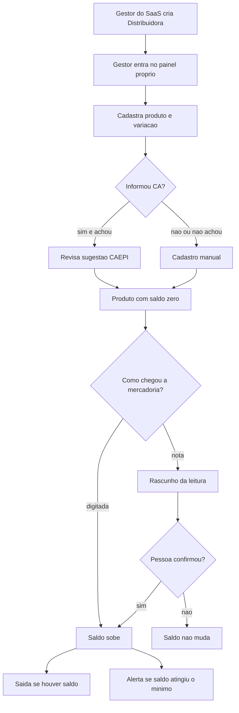

# Fluxo do App — Entidade Distribuidora (ProntEPI)

> Como o usuário se move pelo produto.
> Fonte: [x] Entrevista com usuário  [x] Leitura de código existente (login e painéis atuais, só para não reutilizar o fluxo da consultoria)
> Depende de: [PRD](PRD.md)

**Data**: 2026-10-02

O lançamento cobre as jornadas 1 a 6. As jornadas 7 e 8 estão no PRD como fases seguintes e não entram no piloto.

## 1. Perfis de usuário

| Perfil | Descrição | Permissões principais |
|---|---|---|
| Gestor do SaaS | Quem abre contas no ProntEPI hoje | Cria a organização do tipo Distribuidora e o primeiro acesso. Não opera o depósito. |
| Gestor da distribuidora | Dono operacional do depósito | Cadastra produto e variação, define estoque mínimo, confirma entrada lida de nota, registra entrada e saída, vê alertas. |
| Operador de estoque | Quem recebe e dá baixa no depósito | Registra entrada manual, envia nota para leitura, confirma rascunho, registra saída. Não cria a conta no SaaS. |

Papéis internos mais finos (comprador, financeiro, vendedor) existem no produto final e ficam fora do lançamento. No piloto, gestor e operador enxergam as mesmas telas de estoque. A separação de quem pode apagar produto ou mudar o mínimo fica a definir se o piloto exigir.

Usuário de consultoria e usuário do portal do cliente não entram neste painel.

## 2. Jornadas principais

### Jornada: Abrir a conta Distribuidora

Perfil: Gestor do SaaS

1. Entra no painel do SaaS, no mesmo lugar em que cria uma consultoria.
2. Escolhe o tipo Distribuidora e informa o nome da empresa.
3. O sistema cria a organização sem franquia de vidas e sem portal de cliente.
4. Cadastra o primeiro usuário (gestor da distribuidora) e entrega o acesso.
5. Esse usuário entra e cai no painel da Distribuidora, não no da consultoria.

Telas envolvidas: lista de contas do SaaS, formulário de nova conta com o tipo, convite ou senha inicial do gestor.
Fluxo de erro/exceção: nome ou documento duplicado impede a criação. Tipo consultoria continua o fluxo atual, sem estas telas.

### Jornada: Cadastrar produto do depósito

Perfil: Gestor da distribuidora

1. Abre o cadastro de produtos.
2. Informa nome, SKU do fornecedor, SKU interno, NCM e a variação (numeração ou P/M/G).
3. Ponto de decisão: se informar um número de CA, o sistema consulta a base CAEPI.
4. Se o CA existir, a descrição sugerida aparece para revisão. A pessoa confirma ou edita.
5. Se o CA não existir ou vier vazio, o cadastro segue manual.
6. Define o estoque mínimo daquele item (ou deixa sem mínimo, e então não há alerta).
7. Salva. O saldo inicial é zero até uma entrada.

Telas envolvidas: lista de produtos, formulário de produto, bloco de sugestão CAEPI.
Fluxo de erro/exceção: SKU interno repetido na mesma distribuidora não grava. Falha na consulta CAEPI não bloqueia o cadastro manual.

### Jornada: Dar entrada manual no depósito

Perfil: Operador de estoque ou gestor

1. Escolhe o produto e a variação.
2. Informa a quantidade que chegou.
3. Confirma.
4. O saldo sobe e fica registrado o movimento de entrada.

Telas envolvidas: saldo do depósito, formulário de entrada.
Fluxo de erro/exceção: quantidade vazia ou zero não grava. Produto inexistente manda a pessoa para o cadastro antes.

### Jornada: Ler uma nota de compra e confirmar a entrada

Perfil: Operador de estoque ou gestor

1. Envia o PDF ou a foto da nota de compra.
2. O sistema devolve um rascunho: fornecedor, número da nota se legível, linhas com descrição, quantidade, custo e CA quando aparecer.
3. Ponto de decisão, linha a linha: a pessoa associa a linha a um produto já cadastrado, ou pede para cadastrar um produto novo a partir da sugestão.
4. A pessoa corrige quantidade e variação.
5. Confirma o rascunho.
6. Só então o saldo sobe, um movimento de entrada por linha confirmada.

Telas envolvidas: envio do documento, revisão do rascunho, cadastro rápido se a linha não casar com produto, saldo atualizado.
Fluxo de erro/exceção: PDF sem texto legível e sem imagem utilizável não gera rascunho. A pessoa cai na entrada manual. Fechar a tela sem confirmar não mexe no saldo. Linha sem produto associado não entra na confirmação.

### Jornada: Dar saída do depósito

Perfil: Operador de estoque ou gestor

1. Escolhe o produto e a variação.
2. Informa a quantidade que saiu.
3. Ponto de decisão: se a quantidade for maior que o saldo, a saída não grava.
4. Se couber no saldo, confirma. O saldo desce. Não emite nota fiscal.

Telas envolvidas: saldo do depósito, formulário de saída.
Fluxo de erro/exceção: saldo insuficiente mostra a quantidade disponível e permanece no formulário.

### Jornada: Ver o que está acabando

Perfil: Gestor da distribuidora

1. Abre o painel e vê a lista de itens cujo saldo está no mínimo ou abaixo.
2. A cobertura-alvo de 30 a 40 dias é referência de negócio. No lançamento o aviso dispara pelo mínimo cadastrado no produto, não por um cálculo automático de dias, até essa regra ser fechada com eles.
3. A partir do alerta, a pessoa decide comprar fora do sistema (pedido de compra ainda não existe) e depois registra a entrada quando a mercadoria chegar.

Telas envolvidas: início do painel com a lista de estoque baixo, saldo do item.
Fluxo de erro/exceção: produto sem mínimo não aparece na lista. Lista vazia significa que nenhum item com mínimo estourou.

### Jornada posterior: Pedido, orçamento, nota e financeiro

Não faz parte do lançamento. Quando entrar, a ordem já validada nas gravações é: pedido de compra com duas liberações, recebimento (a entrada acima), orçamento com teto de desconto configurável e aprovação acima do teto, aprovação financeira do cliente, expedição com baixa, e só então NF-e. A nota de compra confirmada também gera contas a pagar. Plano de contas, DRE, fluxo de caixa e conciliação vêm nesse bloco.

### Jornada posterior: Plus almoxarifado

Não faz parte do lançamento. A saída deixaria de ser só baixa interna e passaria a abastecer o estoque de uma empresa já cliente do ProntEPI, por um vínculo explícito entre as duas contas.

## 3. Diagrama

Lançamento, da conta até o saldo:

---

## Gaps & Recomendações (preencher só no Modo B — análise de repo existente)

Não se aplica. Modo A.
